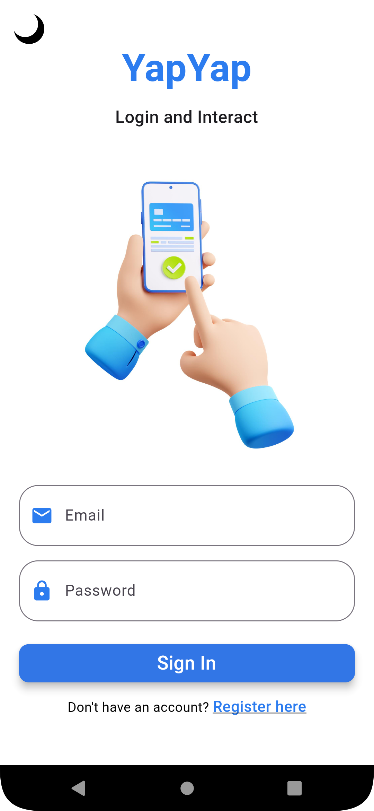
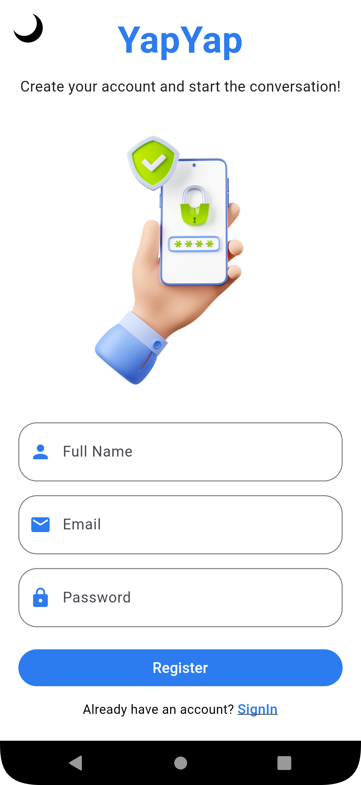
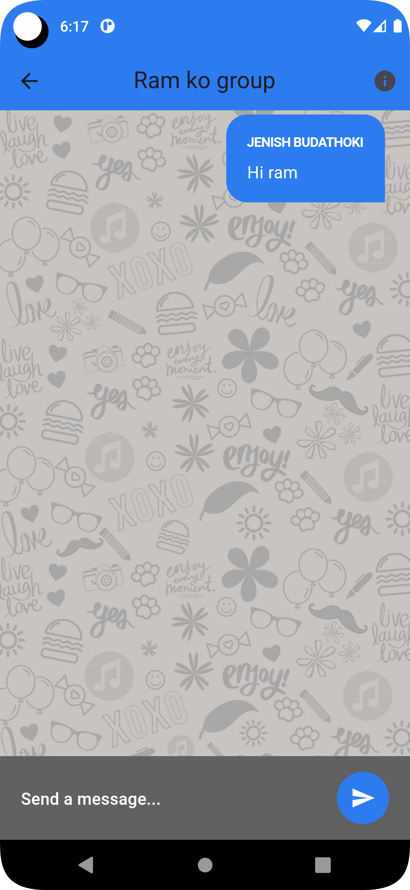

# YapYap

A Flutter chat app with Firebase CRUD and authentication.

## Features

- Real-time Chat: Users can send and receive messages in real-time, creating a seamless chatting experience.
- User Authentication: Firebase Authentication is integrated to provide secure user registration and login functionality.
- CRUD Operations: Users can create, read, update, and delete their chat messages as needed.
- Firebase Firestore: Firestore is used as the backend database to store and manage chat messages.

## Screenshots

  
  

  
  

## Acknowledgments

- Thanks to the Flutter and Firebase communities for their amazing tools and support.

## Contact

For any inquiries or feedback, please contact us at yapyap@gmail.com

Happy chatting with YapYap! 💬

